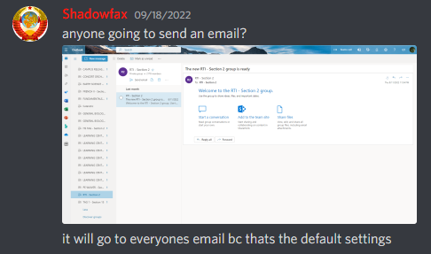

Anchor: Alright, to start off, **REDACTED**, what prompted you to send the first email?

Rekatio: yeah, ok.

Rekatio: no. 1: well, you see, my friend, I thought I was mad funny. sending 'brother, I am here to consul you about you cars extened warrenty' was genuis to me.

Anchor: How did you find out that you could send an email to everyone?

Rekatio: As soon as I saw it said 'it is sending to 2176 student,' or something like that, I knew it would send. and that made it that much sweeter.

Anchor: So you were in no way influenced by this message?

Rekatio: oh, yes, that gave me the inspiration. I thank **REDACTED** every day.

Anchor: Alright, could you outline your night immediately after the incident?

Rekatio: after I sent the message, I was just watching and laughing at the chat. then, 3 hour later, I went to sleep. laughing the whole time.

Anchor: What interrogation tactics did the school administration use to make a confession, and when were you pulled out of class?

Rekatio: simply enough, they just asked me questions. no nothing else.

Rekatio: albiet, they did put me in that godforaken office for like 3 hours. so maybe increasing my suffering?

Rekatio: as soon as i got up the stairs, the lady was waiting for me. as soon as she said 'is your name **REDACTED**,' i knew.

Anchor: What kind of questions did they ask you?

Rekatio: if i can recall correctly: 'do you know why you are in here?' 'what did you do?' 'did you know it would send to everyone?' 'did you do it on puprose?' 'what did the email say?' 'did you say anything else or engage in the converstaion?' 'why did you do it, again?' that.

Anchor: Did you answer all the questions to the best of your ability?

Rekatio: this was my tactic: Answer everything with the upmost honesty and confidence. I also made sure to laugh a bit and be in a happy mood. I tried to make sure to be as charismatic and charming as possible, to maybe increase my odds?

Rekatio: and i think it might have worked.

Anchor: Do you have anything else to say?

Rekatio: I love those 2 ass[istant] principles. I love them with all my heart. they're great people!

Anchor: Alright, thanks for agreeing to this interview. How comfortable are you with this interview's use?

Rekatio: what will it be used for?

Anchor: Nothing without your permission.

Rekatio: what were you planning on doing with this?

Rekatio: was it just for the lols?

Anchor: Nothing in particular, maybe keep as valuable linnmar history, and mainly for the lols.

Rekatio: i see, i see.

Rekatio: wait, on this, put in that my remorse was honest. bless the IT and principles for being up so late.

Anchor: Will do.

Rekatio: I dont believe there is anything else. if that is it, its been a pleasure.

Anchor: Same here, have a good night.